# 一、 绪论

## 1.1 项目描述

**基于MySQL，设计并实现一个简单的旅行预订系统，应用系统应完成如下基本功能：**

航班，大巴车，宾馆房间和客户基础数据的入库，更新（表中的属性也可以根据你的需要添加）。

预定航班，大巴车，宾馆房间。

查询航班，大巴车，宾馆房间，客户和预订信息。

查询某个客户的旅行线路。

检查预定线路的完整性。


## 1.2 开发环境

操作系统平台： Windows 10

服务器平台： 阿里云

## 1.3 开发工具

数据库管理系统：MySQL

数据库连接API：mysqlclient

程序设计语言：Python, JavaScript

集成开发环境：Pycharm, VSCode 


# **二、需求分析与概要设计** 

## 2.1 **需求分析**

系统用户为顾客、管理员。

管理员可以管理航班、大巴班车、宾馆房间和客户的信息。

顾客可以预定航班，大巴车，宾馆房间；可以查询航班，大巴车，宾馆房间，客户和预订信息；可以查询某个客户的旅行线路；可以检查预定线路的完整性。

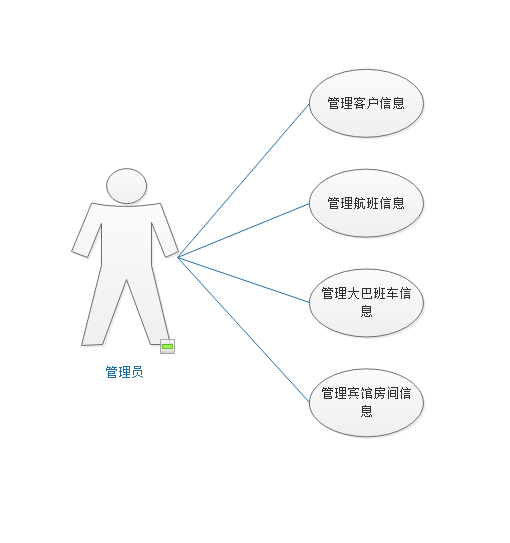

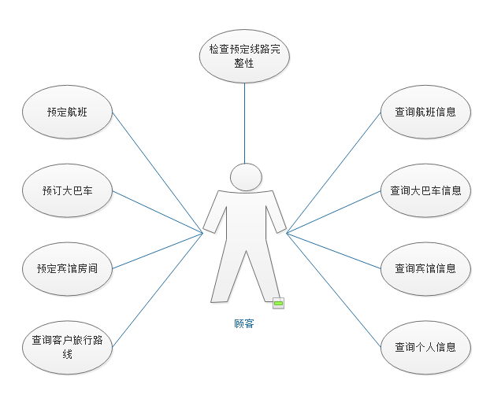


## 2.2 数据库设计

**ER图：**

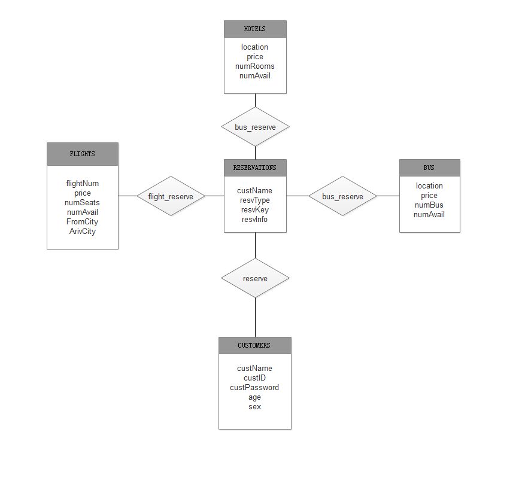

**数据库表设计：**

**FLIGHTS**

| 字段名    | 字段类型    | 是否可为空 | 默认值 | 字段含义   | 注释 |
| --------- | :---------- | ---------- | ------ | :--------- | ---- |
| flightNum | VARCHAR(50) | NOT NULL   |        | 航班号     | 主码 |
| price     | INT         | NOT NULL   |        | 票价       |      |
| numSeats  | INT         | NOT NULL   |        | 座位数     |      |
| numAvail  | INT         | NOT NULL   |        | 剩余座位数 |      |
| FromCity  | VARCHAR(50) | NOT NULL   |        | 起始地     |      |
| ArivCity  | VARCHAR(50) | NOT NULL   |        | 目的地     |      |

**HOTELS**

| 字段名   | 字段类型    | 是否可为空 | 默认值 | 字段含义   | 注释 |
| -------- | :---------- | ---------- | ------ | :--------- | ---- |
| location | VARCHAR(50) | NOT NULL   |        | 地点       | 主码 |
| price    | INT         | NOT NULL   |        | 房间价     |      |
| numRooms | INT         | NOT NULL   |        | 房间数     |      |
| numAvail | INT         | NOT NULL   |        | 剩余房间数 |      |

**BUS**

| 字段名   | 字段类型    | 是否可为空 | 默认值 | 字段含义   | 注释 |
| -------- | :---------- | ---------- | ------ | :--------- | ---- |
| location | VARCHAR(50) | NOT NULL   |        | 地点       | 主码 |
| price    | INT         | NOT NULL   |        | 票价       |      |
| numBus   | INT         | NOT NULL   |        | 座位数     |      |
| numAvail | INT         | NOT NULL   |        | 剩余座位数 |      |

**CUSTOMERS**

| 字段名       | 字段类型     | 是否可为空 | 默认值 | 字段含义 | 注释 |
| ------------ | :----------- | ---------- | ------ | :------- | ---- |
| custName     | VARCHAR(50)  | NOT NULL   |        | 姓名     | 主码 |
| custID       | VARCHAR(20)  | NOT NULL   |        | 顾客ID号 |      |
| custPassword | VARCHAR(20)  | NOT NULL   |        | 顾客密码 |      |
| age          | INT          | NULL       |        | 年龄     |      |
| sex          | VARCHAR（5） | NULL       |        | 性别     |      |
| Balance      | INT          | NULL       | 0      | 余额     |      |

**RESERVATIONS**

| 字段名   | 字段类型    | 是否可为空 | 默认值 | 字段含义 | 注释  |
| -------- | :---------- | ---------- | ------ | :------- | :---- |
| custName | VARCHAR(50) | NOT NULL   |        | 姓名     |       |
| resvType | INT         | NOT NULL   |        | 预约类型 | 1/2/3 |
| resvKey  | VARCHAR(50) | NOT NULL   |        | 预约键值 | 主码  |
| resvInfo | VARCHAR(50) | NOT NULL   |        | 预约信息 |       |

resvType：1为预订航班；2为预订宾馆房间；3为预订大巴车。

**Administrator**

| 字段名        | 字段类型    | 是否可为空 | 默认值 | 字段含义   | 注释 |
| ------------- | :---------- | ---------- | ------ | :--------- | :--- |
| adminID       | VARCHAR(50) | NOT NULL   |        | 管理员ID   | 主码 |
| adminPassword | VARCHAR(50) | NOT NULL   |        | 管理员密码 |      |
| Balance       | INT         | NOT NULL   |        | 系统收入   |      |

## 2.3 功能模块

功能结构图：

模块功能说明：

1、根据业务分析得到的具体需求，将系统进行模块化分析，可以将管理员系统分为：管理员模块，具体模块功能如下：

（1）管理模块：管理用户信息，管理航班信息，管理大巴车信息，管理旅店信息；

2、将用户功能分为：基本模块，预定模块，旅行线路模块。

（1）基本模块：登录，注册，登出

（2）预定模块：查询航班，大巴车，宾馆房间，客户和预订信息、预定航班，大巴车，宾馆房间。

（3）旅行线路模块：查询用户的旅行线路、检查预定线路的完整性。


# 三、 详细设计及实现

## 3.1 模块设计及业务落实设计

- admin: 管理员功能
- customer: 用户功能

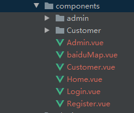

### 3.1.1 用户基本模块

#### 3.1.1.1 登录

- user_login
- 登陆后将 session 的 is_login 置为True
- 将相关employee信息存入session

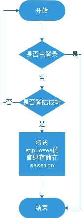

**代码：**

```python
def cust_login(request):
    response = {}
    if request.session.get('is_login', None):
        response['msg'] = 'this employee has logined'
        response['error_num'] = 0
        response['position'] = request.session.get('position')
        return JsonResponse(response)

    if request.method == 'POST':
        login_form = LoginForm(request.POST)
        response['msg'] = 'please check '
        print(login_form)
        id = login_form.cleaned_data['id']
        password = login_form.cleaned_data['password']
        position = login_form.cleaned_data['position']
        if position=='customer':
            try:
                user = CUSTOMERS.objects.get(custID=id)
                if user.custPassword == password:
                    request.session['is_login'] = True
                    request.session['custName'] = user.custName
                    request.session['position'] = "customer"
                    response['msg'] = '登陆成功'
                    response['error_num'] = 0
                    response['position'] = "customer"
                    return JsonResponse(response)
                else:
                    response['msg'] = '登录失败：密码错误'
                    response['error_num'] = 1
                    return JsonResponse(response)
            except:
                response['msg'] = '登录失败：账号不存在'
                response['error_num'] = 1
                return JsonResponse(response)
        else:
            try:
                user = Administrator.objects.get(adminID=id)
                if user.adminPassword == password:
                    request.session['is_login'] = True
                    request.session['id'] = user.adminID
                    request.session['position'] = "administrator"
                    response['msg'] = 'login successfully'
                    response['error_num'] = 0
                    response['position'] = "administrator"
                    return JsonResponse(response)
                else:
                    response['msg'] = '登录失败：密码错误'
                    response['error_num'] = 1
            except:
                response['msg'] = '登录失败：账号不存在'
                response['error_num'] = 1

    return JsonResponse(response)
```

#### 3.1.1.2 登出

- user_logout

- 先通过session判断是否is_login，如果已经登录，则清空session实现登出

  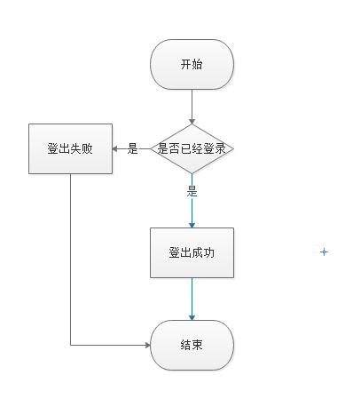

  

**代码：**

```python
@csrf_exempt
@require_http_methods("POST")
def logout(request):
    response = {}

    if not request.session.get('is_login'):
        response['msg'] = 'have not login'
        response['error_num'] = 0
        return JsonResponse(response)
    request.session.flush()
    response['msg'] = 'logout successfully'
    response['error_num'] = 1
    return JsonResponse(response)
```


#### 3.1.1.2 注册

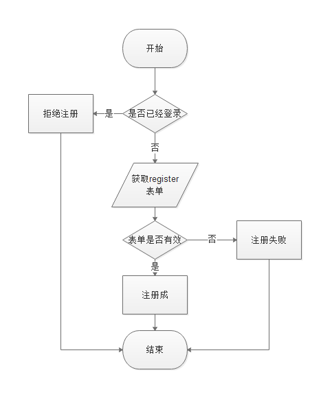

**代码：**

```python
@csrf_exempt
@require_http_methods("POST")
def register(request):
    response = {}
    if request.method == "POST":
        register_form = RegisterForm(request.POST)
        print("here")
        if register_form.is_valid():
            custID = register_form.cleaned_data['custID']
            custPassword = register_form.cleaned_data['custPassword']
            custName = register_form.cleaned_data['custName']
            age = register_form.cleaned_data['age']
            sex = register_form.cleaned_data['sex']
            balance = register_form.cleaned_data['balance']

            try:
                same_cust = CUSTOMERS.objects.get(custName=custName)
                response['msg'] = '该用户已注册！'
                response['error_num'] = 2
                return JsonResponse(response)

            except Exception as e:
                new_cust = CUSTOMERS(
                    custName=custName,
                    custID=custID,
                    custPassword=custPassword,
                    age=age,
                    sex=sex,
                    balance=balance
                )
                response['msg'] = '注册成功'
                response['error_num'] = 0
                new_cust.save()
        else:
            response['msg'] = '表单格式有误'
            response['error_num'] = 1

    return JsonResponse(response)
```


### 3.1.2 管理员模块

#### 3.1.2.1 添加用户

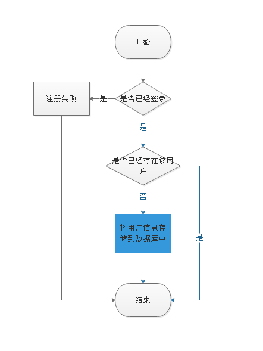

**代码：**

```python
@csrf_exempt
@require_http_methods(["POST"])
def add_one_customer(request):
    response = {}
    try:
        customer_form = CUSTOMERSForm(request.POST)
        if customer_form.is_valid():
            customer_name = customer_form.cleaned_data['custName']
            try:
                CUSTOMERS.objects.get(custName=customer_name)
                response['msg'] = '该用户已添加'
                response['error_num'] = 1
            except:

                customer = CUSTOMERS(custName=customer_name,
                                    custID=customer_form.cleaned_data['custID'],
                                    custPassword=customer_form.cleaned_data['custPassword'],
                                    age=customer_form.cleaned_data['age'],
                                    sex=customer_form.cleaned_data['sex'],
                                    balance=customer_form.cleaned_data['balance']
                                    )
                customer.save()
                response['msg'] = '添加用户成功'
                response['error_num'] = 0
        else:
            response['msg'] = '表单格式有误'
            response['error_num'] = 1
    except  Exception as e:
        response['msg'] = str(e)
        response['error_num'] = 2
    return JsonResponse(response)
```

#### 3.1.2.2 显示用户信息

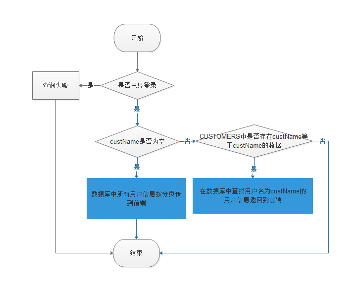

**代码：**

```python
@require_http_methods(["GET"])
def show_customer(request):
    response = {}
    try:
        if request.GET.get('custName') != '':
            print(( request.GET.get('custName')))
            customer = CUSTOMERS.objects.get(custName=request.GET.get('custName'))
            response['list'] = object_to_json(customer)
            total = 1
            response['total'] = total
            response['error_num'] = -1
        else:
            # 返回值增加了分页，把数据分成每页pagesize个数据
            customer = CUSTOMERS.objects.all()
            listall =  json.loads(serializers.serialize("json", customer))
            total = int(len(listall))
            pagesize = int(request.GET.get('pagesize'))
            pagenum = int(request.GET.get('pagenum'))
            # print(pagesize, pagenum)
            if pagesize>total:
                pagesize = total
            sort_ls = [listall[i:i + pagesize] for i in range(0, len(listall), pagesize)]
            response['list'] = sort_ls[pagenum-1]
            response['error_num'] = 0
        response['msg'] = '显示用户成功'
        response['total'] = total
    except  Exception as e:
        if str(e) == "range() arg 3 must not be zero":
            response['error_num'] = 0
            response['msg'] = 'successfully'
        else:
            response['msg'] = str(e)
            response['error_num'] = 1
    return JsonResponse(response)
```


#### 3.1.2.3 修改用户信息

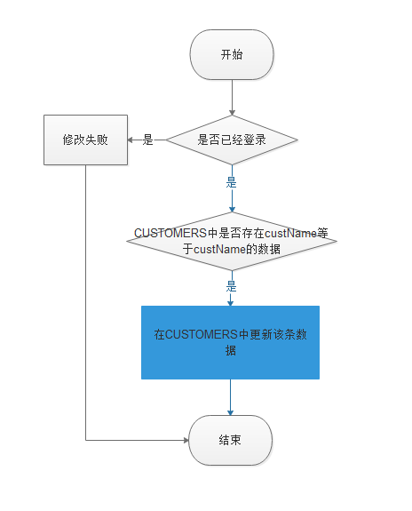

**代码：**

```python
@csrf_exempt
@require_http_methods(['POST'])
def change_one_customer(request):
    response = {}
    try:
        customer_form = CUSTOMERSForm(request.POST)
        if customer_form.is_valid():
            customer_name = customer_form.cleaned_data['custName']
            try:
                customer = CUSTOMERS.objects.get(custName=customer_name)
                customer.custID = customer_form.cleaned_data['custID']
                customer.custPassword = customer_form.cleaned_data['custPassword']
                customer.age = customer_form.cleaned_data['age']
                customer.sex = customer_form.cleaned_data['sex']
                customer.balance = customer_form.cleaned_data['balance']
                customer.save()
                response['msg'] = '修改成功'
                response['error_num'] = 0
            except Exception as e:
                response['msg'] = '该用户不存在！'
                response['error_num'] = 1
        else:
            response['msg'] = '表单格式有误！'
            response['error_num'] = 1

    except Exception as e:
        response['msg'] = str(e)
        response['error_num'] = 2
    return JsonResponse(response)

```


#### 3.1.2.4 删除用户

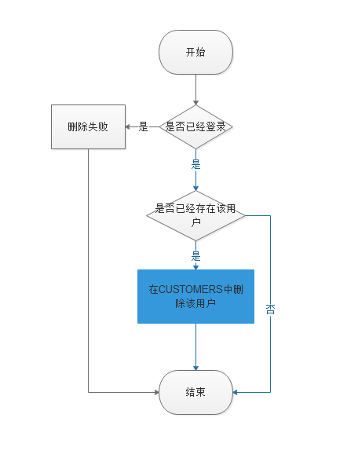

**代码：**

```python
@csrf_exempt
@require_http_methods(['POST'])
def delete_one_customer(request):
    response = {}
    try:
        customer_form = CUSTOMERSForm(request.POST)
        if customer_form.is_valid():
            customer_name = customer_form.cleaned_data['custName']
            try:
                customer = CUSTOMERS.objects.get(custName=customer_name)
                customer.delete()
                response['msg'] = '删除成功'
                response['error_num'] = 0
            except Exception as e:
                response['msg'] = '该用户不存在，删除失败！'
                response['error_num'] = 1
        else:
            response['msg'] = '表单格式有误！'
            response['error_num'] = 1

    except Exception as e:
        response['msg'] = str(e)
        response['error_num'] = 2
    return JsonResponse(response)
```


#### 3.1.2.4 添加航班、大巴、旅店信息

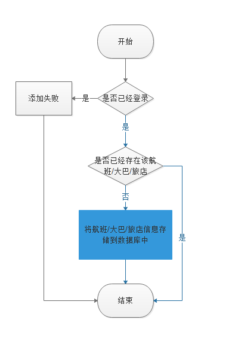

**代码(以添加航班为例，大巴与旅店类似)：**

```python
@csrf_exempt
@require_http_methods(["POST"])
def add_one_flight(request):
    response = {}
    try:
        flight_form = FLIGHTSForm(request.POST)
        if flight_form.is_valid():
            flight_num = flight_form.cleaned_data['flightNum']
            try:
                FLIGHTS.objects.get(flightNum=flight_num)
                response['msg'] = '该航班已添加'
                response['error_num'] = 1
            except:

                flight = FLIGHTS(flightNum=flight_num,
                                    price=flight_form.cleaned_data['price'],
                                    numSeats=flight_form.cleaned_data['numSeats'],
                                    numAvail=flight_form.cleaned_data['numAvail'],
                                    FromCity=flight_form.cleaned_data['FromCity'],
                                    ArivCity=flight_form.cleaned_data['ArivCity']
                                    )
                flight.save()
                response['msg'] = '添加航班成功'
                response['error_num'] = 0
        else:
            response['msg'] = '表单格式有误'
            response['error_num'] = 1
    except  Exception as e:
        response['msg'] = str(e)
        response['error_num'] = 2
    return JsonResponse(response)
```


#### 3.1.2.5 查看航班、大巴、旅店信息

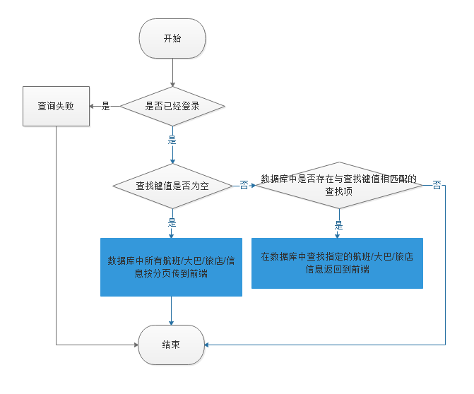

**代码(以查询航班信息为例，大巴与旅店类似)：**

```python
@require_http_methods(["GET"])
def show_flight(request):
    response = {}
    try:
        if request.GET.get('flightNum') != '':
            print(( request.GET.get('flightNum')))
            flight = FLIGHTS.objects.get(flightNum=request.GET.get('flightNum'))
            print(flight)
            response['list'] = object_to_json(flight)
            total = 1
            response['total'] = total
            response['error_num'] = -1
        elif request.GET.get('FromCity') != '' and request.GET.get('ArivCity') != '':
            flight = FLIGHTS.objects.get(Q(Q(FromCity=request.GET.get('FromCity')) & Q(ArivCity=request.GET.get('ArivCity'))))
            print(flight)
            response['list'] = object_to_json(flight)
            total = 1
            response['total'] = total
            response['error_num'] = -1
            # 将get改成filter  使用 json.loads(serializers.serialize("json", flight))可能更加统一！！后续更改
        else:
            # 返回值增加了分页，把数据分成每页pagesize个数据
            flight = FLIGHTS.objects.all()
            listall =  json.loads(serializers.serialize("json", flight))
            total = int(len(listall))
            pagesize = int(request.GET.get('pagesize'))
            pagenum = int(request.GET.get('pagenum'))
            # print(pagesize, pagenum)
            if pagesize>total:
                pagesize = total
            sort_ls = [listall[i:i + pagesize] for i in range(0, len(listall), pagesize)]
            response['list'] = sort_ls[pagenum-1]
            response['error_num'] = 0
        response['msg'] = '显示航班成功'
        response['total'] = total
    except  Exception as e:
        if str(e) == "range() arg 3 must not be zero":
            response['error_num'] = 0
            response['msg'] = 'successfully'
        else:
            response['msg'] = str(e)
            response['error_num'] = 1
    return JsonResponse(response)
```


#### 3.1.2.6 修改航班、大巴、旅店信息

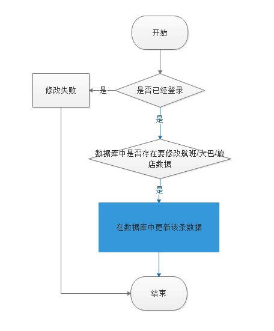

**代码(以修改航班信息为例，大巴与旅店类似)：**

```python
@csrf_exempt
@require_http_methods(['POST'])
def change_one_flight(request):
    response = {}
    try:
        flight_form = FLIGHTSForm(request.POST)
        if flight_form.is_valid():
            flight_num = flight_form.cleaned_data['flightNum']
            try:
                flight = FLIGHTS.objects.get(flightNum=flight_num)
                flight.price = flight_form.cleaned_data['price']
                flight.numSeats = flight_form.cleaned_data['numSeats']
                flight.numAvail = flight_form.cleaned_data['numAvail']
                flight.FromCity = flight_form.cleaned_data['FromCity']
                flight.ArivCity = flight_form.cleaned_data['ArivCity']
                flight.save()
                response['msg'] = '修改成功'
                response['error_num'] = 0
            except Exception as e:
                response['msg'] = '该航班不存在！'
                response['error_num'] = 1
        else:
            response['msg'] = '表单格式有误！'
            response['error_num'] = 1

    except Exception as e:
        response['msg'] = str(e)
        response['error_num'] = 2
    return JsonResponse(response)
```


#### 3.1.2.7 删除航班、大巴、旅店

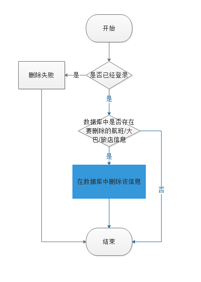

**代码(以删除航班信息为例，大巴与旅店类似)：**

```python
@csrf_exempt
@require_http_methods(['POST'])
def delete_one_flight(request):
    response = {}
    try:
        flight_form = FLIGHTSForm(request.POST)
        if flight_form.is_valid():
            flight_num = flight_form.cleaned_data['flightNum']
            try:
                flight = FLIGHTS.objects.get(flightNum=flight_num)
                flight.delete()
                response['msg'] = '删除成功'
                response['error_num'] = 0
            except Exception as e:
                response['msg'] = '该航班不存在，删除失败！'
                response['error_num'] = 1
        else:
            response['msg'] = '表单格式有误！'
            response['error_num'] = 1

    except Exception as e:
        response['msg'] = str(e)
        response['error_num'] = 2
    return JsonResponse(response)
```


### 3.1.3 用户预订模块

#### 3.1.3.1 查询航班，大巴车，宾馆房间


**代码(以查询航班信息为例，大巴与旅店类似)：**

```python
@require_http_methods(["GET"])
def show_flight(request):
    response = {}
    try:
        if request.GET.get('flightNum') != '':
            print(( request.GET.get('flightNum')))
            flight = FLIGHTS.objects.get(flightNum=request.GET.get('flightNum'))
            print(flight)
            response['list'] = object_to_json(flight)
            total = 1
            response['total'] = total
            response['error_num'] = -1
        elif request.GET.get('FromCity') != '' and request.GET.get('ArivCity') != '':
            flight = FLIGHTS.objects.get(Q(Q(FromCity=request.GET.get('FromCity')) & Q(ArivCity=request.GET.get('ArivCity'))))
            print(flight)
            response['list'] = object_to_json(flight)
            total = 1
            response['total'] = total
            response['error_num'] = -1
            # 将get改成filter  使用 json.loads(serializers.serialize("json", flight))可能更加统一！！后续更改
        else:
            # 返回值增加了分页，把数据分成每页pagesize个数据
            flight = FLIGHTS.objects.all()
            listall =  json.loads(serializers.serialize("json", flight))
            total = int(len(listall))
            pagesize = int(request.GET.get('pagesize'))
            pagenum = int(request.GET.get('pagenum'))
            # print(pagesize, pagenum)
            if pagesize>total:
                pagesize = total
            sort_ls = [listall[i:i + pagesize] for i in range(0, len(listall), pagesize)]
            response['list'] = sort_ls[pagenum-1]
            response['error_num'] = 0
        response['msg'] = '显示航班成功'
        response['total'] = total
    except  Exception as e:
        if str(e) == "range() arg 3 must not be zero":
            response['error_num'] = 0
            response['msg'] = 'successfully'
        else:
            response['msg'] = str(e)
            response['error_num'] = 1
    return JsonResponse(response)
```


#### 3.1.3.2 预定航班，大巴车，**宾馆房间**

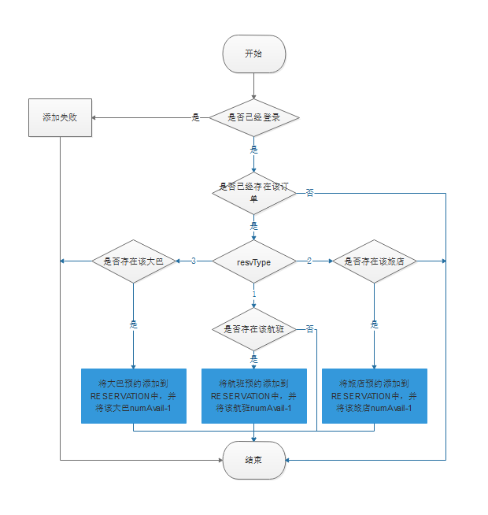

**代码：**

```python
@csrf_exempt
@require_http_methods(['POST'])
def add_reservation(request):
    response = {}
    try:
        reservation_form = RESERVATIONSForm(request.POST)
        if reservation_form.is_valid():
            resvKey = reservation_form.cleaned_data['resvKey']
            try:
                RESERVATIONS.objects.get(resvKey=request.session.get('custName')+resvKey)
                response['msg'] = '该订单已存在'
                response['error_num'] = 1
            except:

                reservation = RESERVATIONS(resvKey=request.session.get('custName')+resvKey,
                               resvType=reservation_form.cleaned_data['resvType'],
                               custName=request.session.get('custName'),
                               resvInfo = reservation_form.cleaned_data['resvInfo']
                               )


                if reservation_form.cleaned_data['resvType'] == 1:
                    flight = FLIGHTS.objects.get(flightNum=resvKey)

                    if flight.numAvail==0:
                        response['msg'] = '无座'
                        response['error_num'] = 2
                        return JsonResponse(response)
                    else:
                        flight.numAvail = flight.numAvail-1
                        flight.save()
                        reservation.save()
                        response['msg'] = '添加订单成功'
                        response['error_num'] = 0
                        return JsonResponse(response)
                elif reservation_form.cleaned_data['resvType'] == 3:

                    print("+++++++++++++++++",resvKey[1:])
                    bus = BUS.objects.get(location = resvKey[1:])

                    if bus.numAvail == 0:
                        response['msg'] = '无座'
                        response['error_num'] = 2
                        return JsonResponse(response)
                    else:
                        bus.numAvail = bus.numAvail - 1
                        bus.save()
                        reservation.save()
                        response['msg'] = '添加订单成功'
                        response['error_num'] = 0
                        return JsonResponse(response)
                elif reservation_form.cleaned_data['resvType'] == 2:
                    hotel = HOTELS.objects.get(location = resvKey[1:])

                    if hotel.numAvail == 0:
                        response['msg'] = '无房'
                        response['error_num'] = 2
                        return JsonResponse(response)
                    else:
                        hotel.numAvail = hotel.numAvail - 1
                        hotel.save()
                        reservation.save()
                        response['msg'] = '添加订单成功'
                        response['error_num'] = 0
                        return JsonResponse(response)


        else:
            response['msg'] = '表单格式有误'
            response['error_num'] = 1
    except  Exception as e:
        response['msg'] = str(e)
        response['error_num'] = 2
    return JsonResponse(response)

```


#### 3.1.3.3 查看预订信息

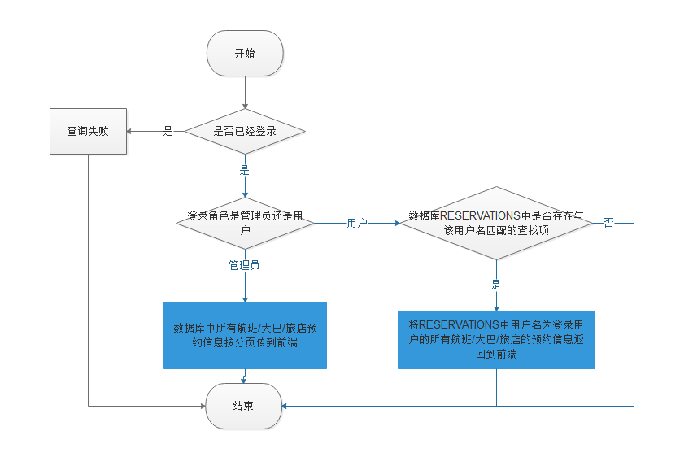

**代码：**

```python
@require_http_methods(["GET"])
def show_reservation(request):
    response = {}
    try:
        if request.session.get('position') == 'administrator':
            reservation = RESERVATIONS.objects.all()
            listall = json.loads(serializers.serialize("json", reservation))
            total = int(len(listall))
            pagesize = int(request.GET.get('pagesize'))
            pagenum = int(request.GET.get('pagenum'))
            # print(pagesize, pagenum)
            if pagesize > total:
                pagesize = total
            sort_ls = [listall[i:i + pagesize] for i in range(0, len(listall), pagesize)]
            response['list'] = sort_ls[pagenum - 1]
            response['error_num'] = 0
            response['msg'] = '显示订单成功'
            response['total'] = total
        else:
            reservation = RESERVATIONS.objects.filter(custName = request.session.get('custName'))
            listall = json.loads(serializers.serialize("json", reservation))
            total = int(len(listall))
            pagesize = int(request.GET.get('pagesize'))
            pagenum = int(request.GET.get('pagenum'))
            # print(pagesize, pagenum)
            if pagesize > total:
                pagesize = total
            sort_ls = [listall[i:i + pagesize] for i in range(0, len(listall), pagesize)]
            response['list'] = sort_ls[pagenum - 1]
            response['error_num'] = 0
            response['msg'] = '显示订单成功'
            response['total'] = total
    except  Exception as e:
        if str(e) == "range() arg 3 must not be zero":
            response['error_num'] = 0
            response['msg'] = 'successfully'
        else:
            response['msg'] = str(e)
            response['error_num'] = 1
    return JsonResponse(response)
```


#### 3.1.3.4 取消预订

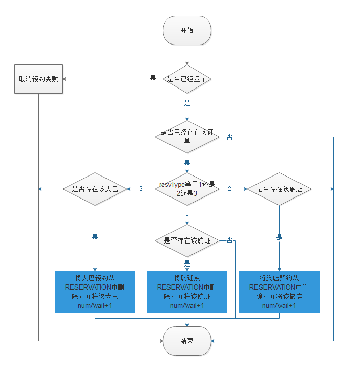

**代码：**

```python
@csrf_exempt
@require_http_methods(['POST'])
def delete_one_reservation(request):
    response = {}
    try:
        reservation_form = RESERVATIONSForm(request.POST)
        if reservation_form.is_valid():
            resvKey = reservation_form.cleaned_data['resvKey']
            try:
                reservation = RESERVATIONS.objects.get(resvKey=resvKey)
                reservation.delete()
                print(resvKey[len(request.session.get('custName')):])
                print(resvKey[len(request.session.get('custName'))+1:])
                if reservation_form.cleaned_data['resvType'] == 1:
                    flight = FLIGHTS.objects.get(flightNum=resvKey[len(request.session.get('custName')):])
                    flight.numAvail = flight.numAvail + 1
                    flight.save()

                elif reservation_form.cleaned_data['resvType'] == 3:
                    bus = BUS.objects.get(location=resvKey[len(request.session.get('custName'))+1:])
                    bus.numAvail = bus.numAvail + 1
                    bus.save()

                elif reservation_form.cleaned_data['resvType'] == 2:
                    hotel = HOTELS.objects.get(location=resvKey[len(request.session.get('custName'))+1:])
                    hotel.numAvail = hotel.numAvail + 1
                    hotel.save()
                response['msg'] = '删除成功'
                response['error_num'] = 0
            except Exception as e:
                response['msg'] = '该订单不存在，删除失败！'
                response['error_num'] = 1
        else:
            response['msg'] = '表单格式有误！'
            response['error_num'] = 1

    except Exception as e:
        response['msg'] = str(e)
        response['error_num'] = 2
    return JsonResponse(response)
```


### 3.1.4 用户旅行线路模块

#### 3.1.4.1 查询用户的旅游线路

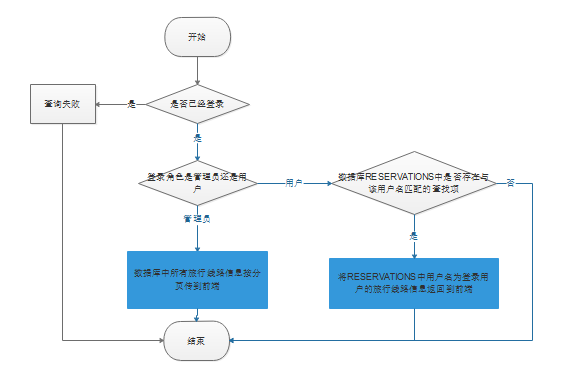

**代码：**

```python
def show_travel_route(request):
    response = {}
    try:
        if request.session.get('position') == 'administrator':
            reservation = RESERVATIONS.objects.filter(resvType = 1)
            listall = json.loads(serializers.serialize("json", reservation))
            total = int(len(listall))
            pagesize = int(request.GET.get('pagesize'))
            pagenum = int(request.GET.get('pagenum'))
            # print(pagesize, pagenum)
            if pagesize > total:
                pagesize = total
            sort_ls = [listall[i:i + pagesize] for i in range(0, len(listall), pagesize)]
            response['list'] = sort_ls[pagenum - 1]
            response['error_num'] = 0
            response['msg'] = '显示订单成功'
            response['total'] = total
        else:
            reservation = RESERVATIONS.objects.filter(Q(Q(custName=request.session.get('custName')) & Q(resvType=1)))
            listall = json.loads(serializers.serialize("json", reservation))
            total = int(len(listall))
            pagesize = int(request.GET.get('pagesize'))
            pagenum = int(request.GET.get('pagenum'))
            # print(pagesize, pagenum)
            if pagesize > total:
                pagesize = total
            sort_ls = [listall[i:i + pagesize] for i in range(0, len(listall), pagesize)]
            response['list'] = sort_ls[pagenum - 1]
            response['error_num'] = 0
            response['msg'] = '显示订单成功'
            response['total'] = total
    except  Exception as e:
        if str(e) == "range() arg 3 must not be zero":
            response['error_num'] = 0
            response['msg'] = 'successfully'
        else:
            response['msg'] = str(e)
            response['error_num'] = 1
    return JsonResponse(response)
```


### 3.1.4.2 检查预定线路的完整性

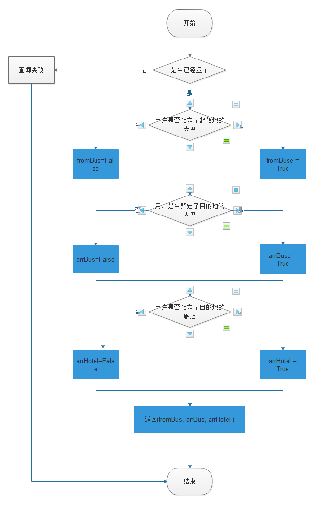

**代码：**

```python
@csrf_exempt
@require_http_methods(['POST'])
def check_route(request):
    response = {}
    try:
        check_form = CHECKForm(request.POST)
        if check_form.is_valid():
            FromCity = check_form.cleaned_data['FromCity']
            ArivCity = check_form.cleaned_data['ArivCity']

            from_bus = len( RESERVATIONS.objects.filter(
                Q(Q(custName=request.session.get('custName')) & Q(resvKey=request.session.get('custName')+'B' + FromCity))))
            arrive_bus = len(RESERVATIONS.objects.filter(
                Q(Q(custName=request.session.get('custName')) & Q(resvKey=request.session.get('custName')+'B' + ArivCity))))
            arrive_hotel = len(RESERVATIONS.objects.filter(
                Q(Q(custName=request.session.get('custName')) & Q(resvKey=request.session.get('custName')+'H' + ArivCity))))

            if(from_bus > 0 and arrive_bus > 0 and arrive_hotel > 0):
                response['from_bus'] = 'true'
                response['arrive_bus'] = 'true'
                response['arrive_hotel'] = 'true'
            elif (from_bus > 0 and arrive_bus > 0 and arrive_hotel == 0):
                response['from_bus'] = 'true'
                response['arrive_bus'] = 'true'
                response['arrive_hotel'] = 'false'
            elif (from_bus > 0 and arrive_bus == 0 and arrive_hotel > 0):
                response['from_bus'] = 'true'
                response['arrive_bus'] = 'false'
                response['arrive_hotel'] = 'true'
            elif (from_bus > 0 and arrive_bus == 0 and arrive_hotel == 0):
                response['from_bus'] = 'true'
                response['arrive_bus'] = 'false'
                response['arrive_hotel'] = 'false'
            elif (from_bus == 0 and arrive_bus > 0 and arrive_hotel > 0):
                response['from_bus'] = 'false'
                response['arrive_bus'] = 'true'
                response['arrive_hotel'] = 'true'
            elif (from_bus == 0 and arrive_bus > 0 and arrive_hotel == 0):
                response['from_bus'] = 'false'
                response['arrive_bus'] = 'true'
                response['arrive_hotel'] = 'false'
            elif (from_bus == 0 and arrive_bus == 0 and arrive_hotel > 0):
                response['from_bus'] = 'false'
                response['arrive_bus'] = 'false'
                response['arrive_hotel'] = 'true'
            elif (from_bus == 0 and arrive_bus == 0 and arrive_hotel == 0):
                response['from_bus'] = 'false'
                response['arrive_bus'] = 'false'
                response['arrive_hotel'] = 'false'

            response['msg'] = '检查成功'
            response['error_num'] = 0
        else:
            response['msg'] = '表单格式有误！'
            response['error_num'] = 1

    except Exception as e:
        response['msg'] = str(e)
        response['error_num'] = 2
    return JsonResponse(response)
```


## 3.2 页面设计

### 3.2.1 登录与退出界面

#### 3.2.1.1 登录业务流程

（1）在登录页面输入用户名和密码

（2）调用后端接口进行验证

（3）通过验证之后，根据后台的响应状态跳转到项目主页

#### 3.2.1.2 登录业务的相关技术点

（1）http是无状态的

（2）可选择cookie/session/token来记录或维持状态，但如果前后端分离，即存在跨域问题，用token


#### 3.2.1.3 登录功能实现

#### 1. 登录页面的布局

##### step 1 基础设置

首先在components中创建Login.vue组件，在该组件中实现登录页面的布局，随后设置router/index.js，为Login组件添加路由‘/login’和重定向路由'/'，最后在App.vue中添加router-view/router-view来重载login页面。

安装less-loader来支持style中的style lang="less" scoped，其中scoped用来指定样式作用的范围是单个组件页面。

```tex
cnpm install less@3.9.0 less-loader@4.1.0 --save-dev
```

##### step 2 通过Element-UI组件来实现布局

el-form来实现表单，即整个页面就是一个表单，在表单中存在一些item项，用el-form-item来指示（文本框，按钮等），el-input（账号密码输入框），el-button（登录、重置、注册按钮），以及字体图标。网址https://element.eleme.io/#/zh-CN/component/icon

```vue
 <el-form label-width="0px" class="login_form" >
          <!--用户名-->
        <el-form-item>
          <el-input prefix-icon="el-icon-s-custom"></el-input>
        </el-form-item>
        <!--密码-->
        <el-form-item >
          <el-input prefix-icon="el-icon-lock"></el-input>
        </el-form-item>
        <!--按钮区域-->
        <el-form-item  class="btns">
          <el-button type="primary">登录</el-button>
          <el-button type="info">重置</el-button>
          <el-button type="info">注册</el-button>
        </el-form-item>
       
      </el-form>
    </div>
```

##### step 3 表单的数据绑定

1. 在el-form中添加:model="form"用来实现数据的绑定

   ```vue
   <!--登录表单区-->
         <el-form :model="loginForm" label-width="0px" class="login_form" >
   	  </el-form>
   ```

   

2. 在每一个表单项中加入 v-model = "form.xxx"绑定到数据对象上对应的属性

   ```vue
   <!--密码-->
           <el-form-item >
             <el-input v-model="loginForm.password" prefix-icon="el-icon-lock"
             type="password"></el-input>
           </el-form-item>
   ```

3. 在script中加入相应的表单数据项

   ```vue
   <script>
   export default {
       data() {
           return {
               //This is login data object
               loginForm: {
                   username: '',
                   password: ''
               }
           }
       }
   };
   </script>
   ```

##### step 4 表单的数据验证
1. 首先在<el-form>中添加：rules属性
```vue
 <el-form :model="loginForm" :rules="loginFormRules" label-width="0px" class="login_form">
</el-form>
```

2.在scrip的data()中添加表单的验证规则对象loginFormRules，并增加对用户名和密码的验证规则。

```javascript
loginFormRules: {
                //验证用户名是否合法
                username: [
                            { required: true, message: '请输入用户名', trigger: 'blur' },
                            { min: 3, max: 10, message: '长度在 3 到 10 个字符', trigger: 'blur' }
                ],
                //验证密码是否合法
                password: [
                            { required: true, message: '请输入密码', trigger: 'blur' },
                            { min: 6, max: 15, message: '长度在 6 到 15 个字符', trigger: 'blur' }
                ]
            }
```

3. 在对应的 <el-form-item >中加入prop = "password"属性，来绑定验证规则。

   

##### step 5 登录组件实现表单的重置

1. 使用ref属性来创建一个表单的引用，在<el-form >中添加ref = “loginFormRef”来构建一个表单的引用

2.  在重置按钮中添加click方法

   ```vue
   <el-button type="info" @click = "resetLoginForm">重置</el-button>
   ```

3. 在scrip中添加对应的重置函数

   ```javascript
   methods: {
           //这是点击重置按钮，重置登录表单
           resetLoginForm() {
              this.$refs.loginFormRef.resetFields()
           }
       }
   //其中restFields()是表单的一个方法，用来清空表单
   
   
   ```
   
   **箭头函数的意思，和普通函数差别不大**
   //函数一： function XXX（）{}
   //函数二：（）=>{}
   //箭头函数特点：写得少，匿名函数，this的指向和外侧保持一致

##### step 6 登录组件发起请求

1. 在main.js中配置axios

   ```javascript
   import axios from 'axios'
   Vue.prototype.$http = axios//为Vue中的所有组件添加一个#http成员，方便访问到axios（#http自己
   //随便起）
   ```

2. 为按钮配置@click方法login，在script中的methods中添加对应的方法login

```javascript
login() {
            this.$refs.loginFormRef.validate(async valid => {
                console.log(valid);
                //回调函数，用于在点击登录时进行预验证，valid是验证结果
                if(!valid) return;
             **const { data: res } = await this.$http.post('登录URL',this.loginForm);
                if(res.meta.status !== 200) return return this.$message.error('登录失败')
                return this.$message.success('登录成功')//弹窗提示
            })
        }
```

##### step 7 登录成功后的行为


1. 路由导航守卫

   

   ```javascript
   router.beforeEach((to, from ,next) => {
     //to 将要访问的路径，
     //from代表从那个路径跳转而来
     // next是一个函数，表示放行， next() 放行、 next('login') 强制跳转
   
     if(to.path === '/login') return next()
     const tokenStr = window.sessionStorage.getItem('token')
     console.log(tokenStr)
     console.log(!tokenStr)
     console.log(to.path)
     if (!tokenStr) return next('/login')//如果没有token就跳转到登录页面
     return next()
   })
   
   ```
2. 退出功能

   删除token实现退出功能
   
#### step 8 为每次请求都自动添加上保存过的token值

   a. 请求拦截器

   ```javascript
   // axios请求拦截
   axios.interceptors.request.use(config => {
   // 为请求头对象，添加Token验证的Authorization字段,config就是请求对象
   	config.headers.Authorization = window.sessionStorage.getItem('token')
   	return config//在最后必须return config 固定写法
   })
   ```

   b. 响应拦截器

   ```javascript
   // use(两个参数)
   axios.interceptors.reponse.use(res => {
       // 请求成功对响应数据做处理
       ...
       // 该返回的数据则是axios.then(res)中接收的数据
       return res
   }, err => {
       // 在请求错误时要做的事儿
       ...
       // 该返回的数据则是axios.catch(err)中接收的数据
       return Promise.reject(err)
   })
   ```


#### 3.2.1.4 界面详情
登录界面：

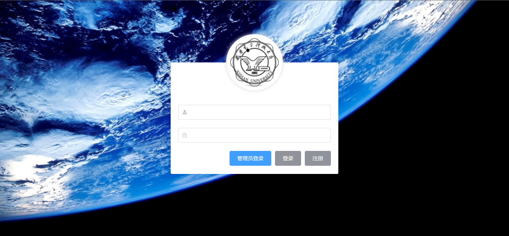


### 3.2.2 注册页面


#### 3.2.2.1 页面设计过程
- 注册界面采用了container控件，form控件，form-item控件，input控件和radio控件，button控件。
- 其中container用来显示页面的布局，包括头部，主体内容区，主题内容区中包括了一个form表单，将表单的的各个项与registerForm表单绑定，并且在输入时，系统根据registerFormRules来对数据进行检测，只有符合rules的数据才能成功写入表单中。
- 在用户输入了相关的信息后，点击注册按钮，系统就通过post请求user_register接口，同时将registerForm表单传递过去。
- 如果返回结果的error_num！==0,此次注册成功。

**申请注册函数代码：**

```javascript
 register() {
      this.$refs.registerFormRef.validate(async (valid) => {
        //回调函数，用于在点击登录时进行预验证，valid是验证结果
        if (!valid)
        {

            return this.$message.error("注册失败！");
        }
        if (this.registerForm.password1 != this.registerForm.password2)
        {

            return this.$message.error("两次密码输入不一致！");
        }
        var employee_id= this.registerForm.employee_id;
        var password1=this.registerForm.password1;
        var password2=this.registerForm.password2;
        var name= this.registerForm.name;
        var sex= this.registerForm.sex;
        var age= this.registerForm.age;


        let postData = this.$qs.stringify(
            {
                custID: employee_id,
                custPassword: password1,
                custName: name,
                age: age,
                sex: sex,
                balance: 0
            }
        )
        const res = await this.$http.post('register',postData);
        console.log(res);
        if(res.error_num !== 0) return this.$message.error(res.msg)
        this.$message.success("注册成功"); //弹窗提示
        this.$router.push("/login");
      });
    },
```


#### 3.2.2.2 界面详情

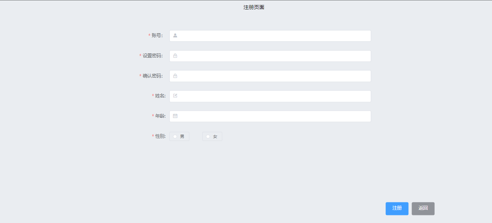

### 3.2.3 管理员用户管理主页设计

#### 3.2.3.1 设计详情

- 采用element-ui中的页面布局和菜单布局，包括头部，和内容主体区域。
- 在头部中添加用户管理，航班管理、大巴管理和旅店管理四个一级菜单，在用户管理中添加用户列表的二级菜单，在航班管理中添加航班列表的二级菜单，在大巴管理中添加大巴列表的二级菜单最后在旅店管理中添加旅店管理二级菜单。
- 在点击这些菜单后，系统将进入admin的子路由中，比如在点击用户列表后，首先系统会调用getCustomers函数来发起get请求，请求结果是返回数据库中的所有customer数据，将这些数据通过Table构建显示在页面上。
- 在页面上还添加了查找功能，来对应显示想要搜索的用户。使用一个Buttom组件来实现添加用户的功能，该功能是一个快速的注册功能，调用的接口也与注册相同。
- 在每一个用户都可以通过右侧的更改按钮下来快速修改用户的信息，同时也可以点击删除按钮来快修删除一个用户。

**添加用户和修改用户的表单：**

```javascript
 registerForm: {
        custName: "",
        custID: "",
        password1: "",
        password2: "",
        age: "",
        sex: "",
        balance: "",
      },

        changeForm: {
        custName: "",
        custID: "",
        password1: "",
        password2: "",
        age: "",
        sex: "",
        balance: "",
      },
```

**显示用户信息核心代码：**

```javascript

    async getCustomer() {
      const { data: res } = await this.$http.get("show_customer", {
        params: this.queryInfo,
      });
```

**添加用户，修改用户，以及删除用户核心代码：**

```javascript
  register() {
      this.$refs.registerFormRef.validate(async (valid) => {
        //回调函数，用于在点击登录时进行预验证，valid是验证结果
        if (!valid)
        {

            return this.$message.error("注册失败！");
        }
        if (this.registerForm.password1 != this.registerForm.password2)
        {

            return this.$message.error("两次密码输入不一致！");
        }
        var employee_id= this.registerForm.custID;
        var password1=this.registerForm.password1;
        var password2=this.registerForm.password2;
        var name= this.registerForm.custName;
        var sex= this.registerForm.sex;
        var age= this.registerForm.age;
        var balance = this.registerForm.balance;

        let postData = this.$qs.stringify(
            {
                custID: employee_id,
                custPassword: password1,
                custName: name,
                age: age,
                sex: sex,
                balance: balance
            }
        )
        const res = await this.$http.post('add_one_customer',postData);
        console.log(res);
        this.$message.success("添加成功"); //弹窗提示
        this.reload();
      });
    },

    change() {
        this.$refs.changeFormRef.validate(async (valid) => {
        //回调函数，用于在点击登录时进行预验证，valid是验证结果
        if (!valid)
        {
            console.log("rrror")
            return this.$message.error("注册失败！");
        }
        if (this.changeForm.password1 != this.changeForm.password2)
        {

            return this.$message.error("两次密码输入不一致！");
        }

        var employee_id= this.changeForm.custID;
        var password1=this.changeForm.password1;
        var name= this.changeForm.custName;
        var sex= this.changeForm.sex;
        var age= this.changeForm.age;
        var balance = this.changeForm.balance;

        let postData = this.$qs.stringify(
            {
                custID: employee_id,
                custPassword: password1,
                custName: name,
                age: age,
                sex: sex,
                balance: balance
            }
        )

        const res = await this.$http.post('change_one_customer',postData);
        console.log(res);
        this.$message.success("修改成功"); //弹窗提示
        this.reload();
      });
    },

    async delete_cust() {
        var employee_id= this.changeForm.custID;
        var password1=this.changeForm.password1;
        var name= this.changeForm.custName;
        var sex= this.changeForm.sex;
        var age= this.changeForm.age;
        var balance = this.changeForm.balance;

        let postData = this.$qs.stringify(
            {
                custID: employee_id,
                custPassword: password1,
                custName: name,
                age: age,
                sex: sex,
                balance: balance
            }
        )

        const res = await this.$http.post('delete_one_customer',postData);
        console.log(res);
        this.$message.success("删除成功"); //弹窗提示
        this.reload();
    },
```

#### 3.2.3.2 页面详情

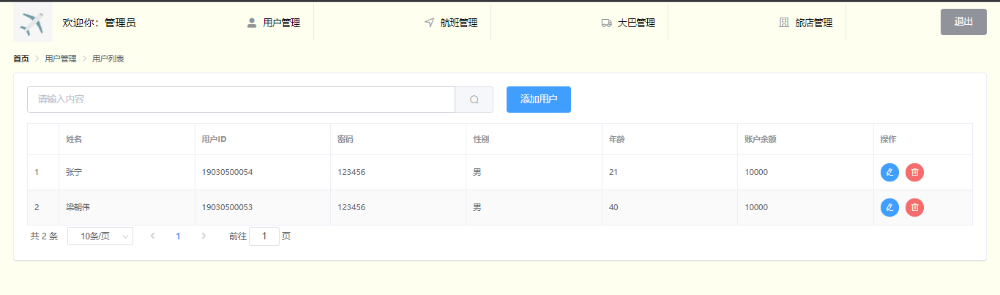

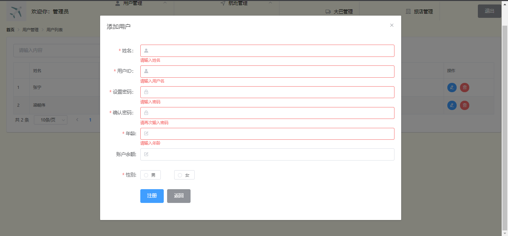

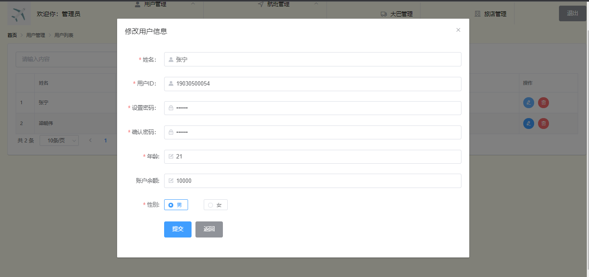

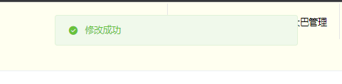

### 3.2.4 管理员航班，大巴，旅店管理主页设计

#### 3.2.4.1 设计详情

- 在点击航班，大巴，旅店列表后，首先系统会调用getFlight、getBus，getHotel函数来发起get请求，请求结果是返回数据库中的所需的航班，大巴，旅店数据。

- 将这些数据通过Table构建显示在页面上，在页面上还添加了查找功能，来对应显示想要搜索的信息。

- 使用一个Buttom组件来实现添加航班、大巴、旅店的功能。

- 在每一条显示的信息都可以通过右侧的更改按钮下来快速修改信息以及删除信息。

- **核心代码：**

  ```javascript
  addFlight() {
        this.$refs.registerFormRef.validate(async (valid) => {
          //回调函数，用于在点击登录时进行预验证，valid是验证结果
          if (!valid)
          {
  
              return this.$message.error("注册失败！");
          }
          var flightNum= this.registerForm.flightNum;
          var price=this.registerForm.price;
          var numSeats=this.registerForm.numSeats;
          var numAvail= this.registerForm.numAvail;
          var FromCity= this.registerForm.FromCity;
          var ArivCity= this.registerForm.ArivCity;
  
  
          let postData = this.$qs.stringify(
              {
                  flightNum: flightNum,
                  price: price,
                  numSeats: numSeats,
                  numAvail: numAvail,
                  FromCity: FromCity,
                  ArivCity: ArivCity
              }
          )
          const res = await this.$http.post('add_one_flight',postData);
          console.log(res);
          this.$message.success("添加成功"); //弹窗提示
          this.reload();
        });
      },
  
      changeFlight() {
          this.$refs.changeFormRef.validate(async (valid) => {
          //回调函数，用于在点击登录时进行预验证，valid是验证结果
          if (!valid)
          {
              console.log("rrror")
              return this.$message.error("修改失败！");
          }
           var flightNum= this.changeForm.flightNum;
          var price=this.changeForm.price;
          var numSeats=this.changeForm.numSeats;
          var numAvail= this.changeForm.numAvail;
          var FromCity= this.changeForm.FromCity;
          var ArivCity= this.changeForm.ArivCity;
  
  
          let postData = this.$qs.stringify(
              {
                  flightNum: flightNum,
                  price: price,
                  numSeats: numSeats,
                  numAvail: numAvail,
                  FromCity: FromCity,
                  ArivCity: ArivCity
              }
          )
  
          const res = await this.$http.post('change_one_flight',postData);
          console.log(res);
          this.$message.success("修改成功"); //弹窗提示
          this.reload();
        });
      },
  
      async deleteFlight() {
          var flightNum= this.changeForm.flightNum;
          var price=this.changeForm.price;
          var numSeats=this.changeForm.numSeats;
          var numAvail= this.changeForm.numAvail;
          var FromCity= this.changeForm.FromCity;
          var ArivCity= this.changeForm.ArivCity;
  
  
          let postData = this.$qs.stringify(
              {
                  flightNum: flightNum,
                  price: price,
                  numSeats: numSeats,
                  numAvail: numAvail,
                  FromCity: FromCity,
                  ArivCity: ArivCity
              }
          )
  
          const res = await this.$http.post('delete_one_flight',postData);
          console.log(res);
          this.$message.success("删除成功"); //弹窗提示
          this.reload();
      },
  ```

  

#### 3.2.4.2 页面详情

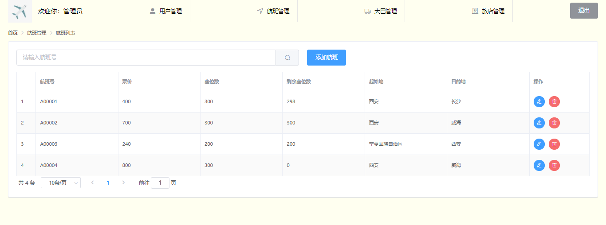

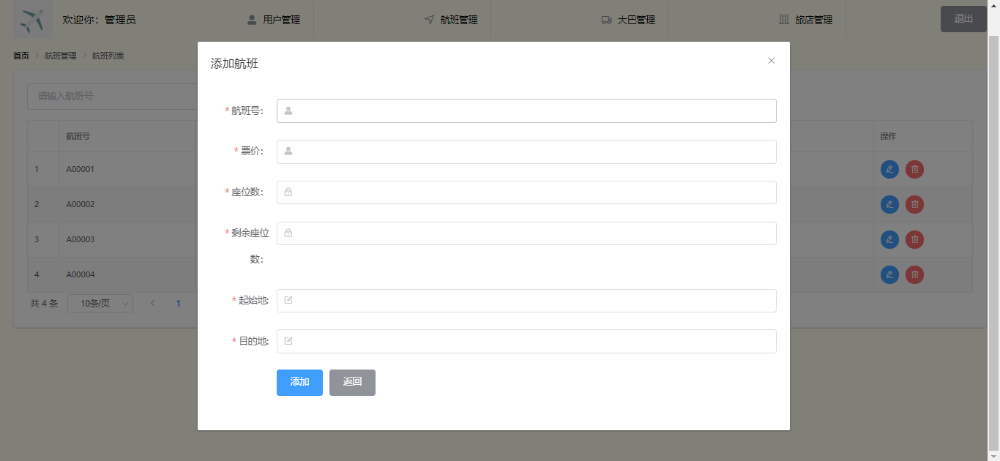

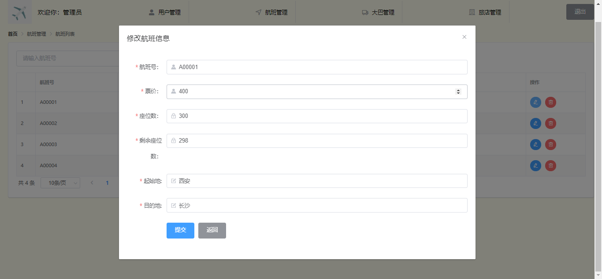

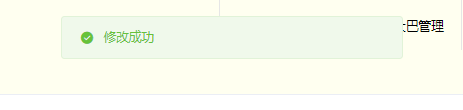

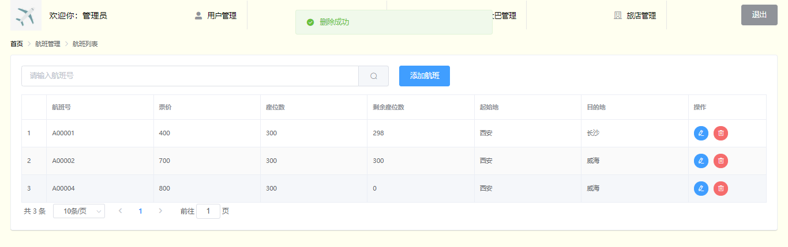

### 3.2.5 用户航班，大巴，旅店预定主页设计

#### 3.2.5.1 设计详情

- 在点击航班，大巴，旅店列表后，首先系统会调用getFlight、getBus，getHotel函数来发起get请求，请求结果是返回数据库中的所需的航班，大巴，旅店数据。

- 将这些数据通过Table构建显示在页面上，在页面上还添加了查找功能，来对应显示想要搜索的信息。

- 使用一个Buttom组件来实现预定航班、大巴、旅店的功能。

- **核心代码：**

  ```javascript
   async getEmployee() {
        const { data: res } = await this.$http.get("show_flight", {
          params: this.queryInfo,
        });
  
        console.log(res);
        if (res.error_num == 1) return this.$message.error(res.msg);
  
        if (res.error_num == -1) {
          (this.employee_list = [
            {
              model: "TRS.flights",
              pk: res.list.flightNum,
              fields: {
                price: res.list.price,
                numAvail: res.list.numAvail,
                numSeats: res.list.numSeats,
                FromCity: res.list.FromCity,
                ArivCity: res.list.ArivCity,
              },
            },
          ]),
            (this.total = 1);
        }
        if (res.error_num == 0) {
          this.employee_list = res.list;
          this.total = res.total;
        }
        console.log(res);
        console.log(this.employee_list);
        console.log(this.total);
      },
      //监听pagesize改变的事件
      handleSizeChange(newSize) {
        console.log(newSize);
        this.queryInfo.pagesize = newSize;
        this.getEmployee();
      },
      //监听页码值改变的事件
      handleCurrentChange(newPage) {
        console.log(newPage);
        this.queryInfo.pagenum = newPage;
        this.getEmployee();
      },
  
       async reservation() {
  
          var resvKey= this.reservationForm.resvKey;
          var resvInfo1= this.reservationForm.resvInfo1
          var resvInfo2= this.reservationForm.resvInfo2
          var resvInfo = resvInfo1+"——"+resvInfo2
          let postData = this.$qs.stringify(
              {
                  resvKey: resvKey,
                  resvType: 1,
                  custName: "张三",
                  resvInfo:resvInfo
              }
          )
          const res = await this.$http.post('add_reservation',postData);
          console.log(res);
          if(res.data.error_num!==0) this.$message.success("没有该类票在售或购票失败"); //弹窗提示
  
          else this.$message.success("支付成功"); //弹窗提示
          this.reload();
        },
  ```

  

#### 3.2.5.2 页面详情

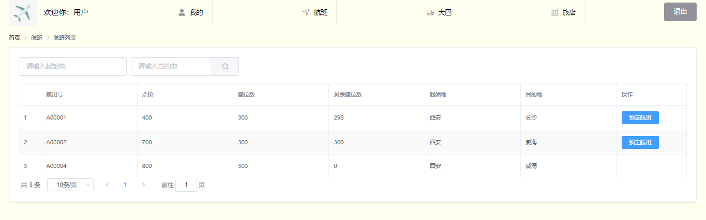

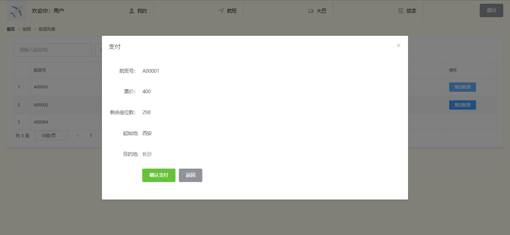

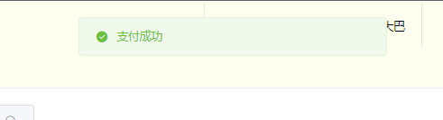

### 3.2.6 用户个人预定主页设计

#### 3.2.6.1 设计详情

- 在点击我的预约后，首先系统会调用getReservation函数来发起get请求，请求结果是返回数据库中的所需的预约数据。

- 将这些数据通过Table构建显示在页面上，在页面上还添加了查找功能，来对应显示想要搜索的信息。

- 使用一个Buttom组件来实现取消预约的功能。

  **核心代码：**

  ```javascript
   async reservation() {
  
          var resvKey= this.changeForm.resvKey;
          var resvType= this.changeForm.resvType
         var resvInfo= this.changeForm.resvInfo
          let postData = this.$qs.stringify(
              {
                  resvKey: resvKey,
                  resvType: resvType,
                  custName: "张三",
                  resvInfo:resvInfo
              }
          )
          const res = await this.$http.post('delete_one_reservation',postData);
          console.log(res);
          this.$message.success("取消成功"); //弹窗提示
          this.reload();
        },
  ```

  

#### 3.2.6.2 页面详情

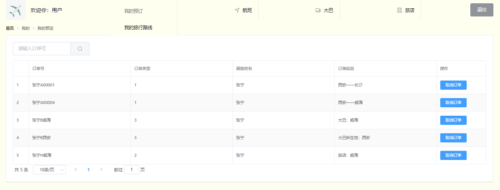

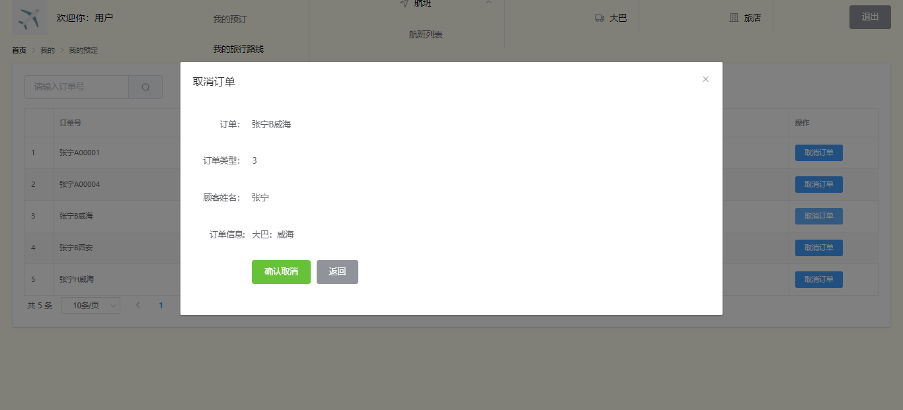

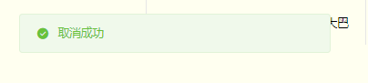

### 3.2.7 用户路线主页设计

#### 3.2.7.1 设计详情

- 在点击我的旅行路线后，首先系统会调用getFlight函数来发起get请求，请求结果是返回数据库中的所需的预约数据。

- 将这些数据通过Table构建显示在页面上，在页面上还添加了查找功能，来对应显示想要搜索的地点。

- 使用一个Buttom组件来实现显示路线起始地和目的地的功能，点击按钮，页面中的地图就会显示出起始地和目的地的地图位置。

- 点击检查路线完整性按钮，系统会调用all_reserve函数，来检查是否预定了起始地的大巴车，是否预定了目的地的大巴车和旅店。

- 在完整性检查结果页面，点击一键预约，就会把未预约的大巴或旅店一次性预约。

  **核心代码：**

  ```javascript
   async all_reserve() {
  
        if (this.CheckResult.from_bus=='false')
        {
          var resvType= 3;
          var resvKey= "B"+this.queryInfo1.fromcity;
          var resvInfo = "大巴所在地："+this.queryInfo1.fromcity;
          let postData = this.$qs.stringify(
              {
                  resvKey: resvKey,
                  resvType: resvType,
                  custName: "张三",
                  resvInfo:resvInfo
              }
          )
          const res = await this.$http.post('add_reservation',postData);
          if(res.data.error_num!==0) this.$message.success("没有该类票在售或购票失败"); //弹窗提示
        }
  
        if (this.CheckResult.arrive_bus=='false')
        {
          var resvType= 3;
          var resvKey= "B"+this.queryInfo1.arrivecity;
          var resvInfo = "大巴："+this.queryInfo1.arrivecity;
          let postData = this.$qs.stringify(
              {
                  resvKey: resvKey,
                  resvType: resvType,
                  custName: "张三",
                  resvInfo:resvInfo
              }
          )
          const res = await this.$http.post('add_reservation',postData);
  
          if(res.data.error_num!==0) this.$message.success("没有该类票在售或购票失败"); //弹窗提示
        }
  
        if (this.CheckResult.arrive_hotel=='false')
        {
          var resvType= 2;
          var resvKey= "H"+this.queryInfo1.arrivecity;
          var resvInfo = "旅店："+this.queryInfo1.arrivecity;
          let postData = this.$qs.stringify(
              {
                  resvKey: resvKey,
                  resvType: resvType,
                  custName: "张三",
                  resvInfo:resvInfo
              }
          )
          const res = await this.$http.post('add_reservation',postData);
          if(res.data.error_num!==0) this.$message.success("没有该类票在售或购票失败"); //弹窗提示
        }
        this.$message.success("预约成功"); //弹窗提示
  
        this.reload();
        },
  ```

  

#### 3.2.7.2 页面详情

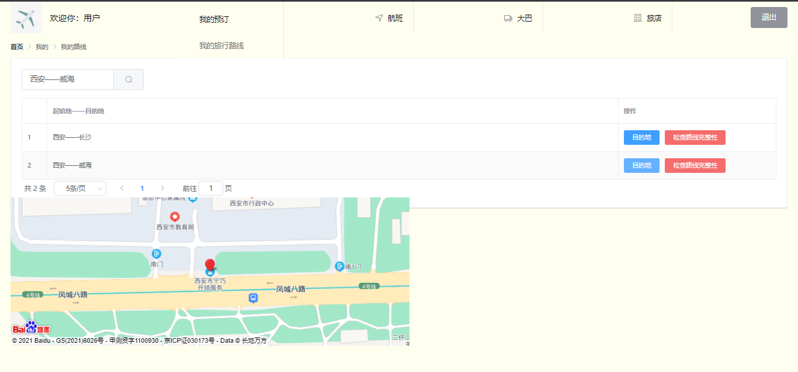

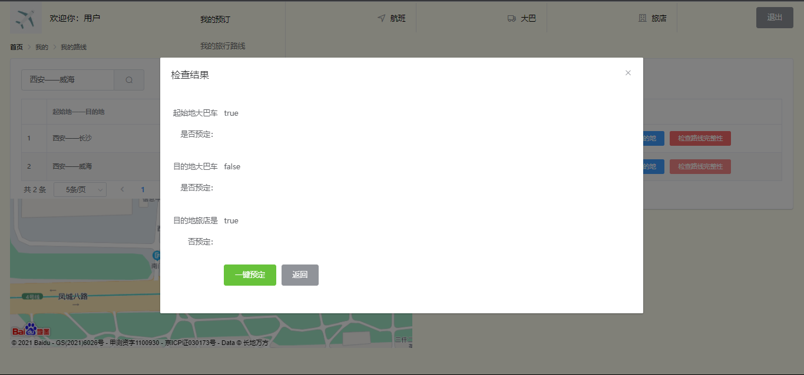

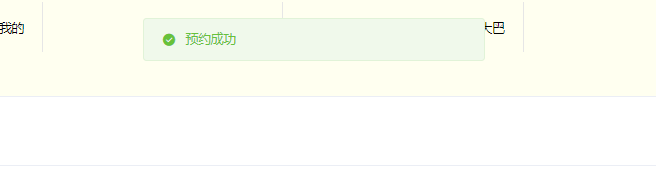

# **四、总结与思考** 


**遇到的问题：**

- BUS数据库和HOTELS数据库都是以LOCATION作为主码，在添加预订信息时，如果已经存在了BUS，就无法在存储与该BUS在同一地点的HOTEL。
- 解决方法：BUS中location改为B+location，HOTELS中location改为H+location。

- session 维持时间很短，导致在一个页面停留几分钟后，部分内容丢失。

- 解决方法：在django 项目文件的setting.py中， 将session的维持时间设置为两周。

- vue前端通过POST请求发送表单给django后端时，接受数据为空。解决方法：在项目中安装qs模块，在需要使用的页面中引入一下，然后将数据用qs转换再发


- 解决方法：送给后端，数据便为Format Data格式了。


**心得总结：**

​	通过这次数据库上机实验，加深了身为软件工程专业的我对软件的理解和认知，熟悉了使用高级程序设计语言去操作数据库的方式方法。有了这次的实验经历，在今后再面对这样的软件系统，我将会更有经验的去应对遇到的问题。
